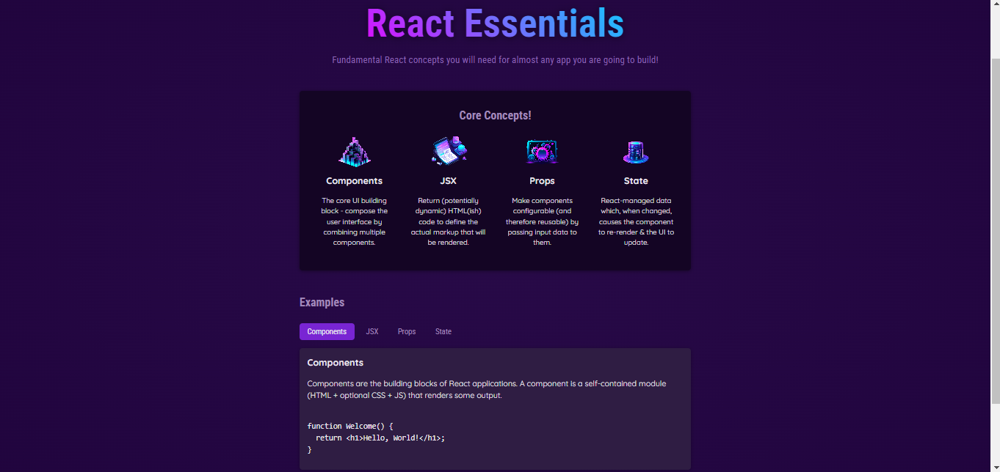

Simple React app to practice some basic react essential topics like jsx, state, components etc.
We also learned how to structure the project according to the real life scalable projects.

### Screenshot of app

### Links

- [Live](https://react-essentials-rahidt.netlify.app/)

## Author

- LinkedIn - [@rahidt](https://www.linkedin.com/in/rahidt/)

## Available Scripts

In the project directory, you can run:

### `npm run dev`

Runs the app in the development mode.

### `npm run build`

Builds the app for production to the `build` folder.

### `npm run preview`

Launches the test runner in the interactive watch mode.

